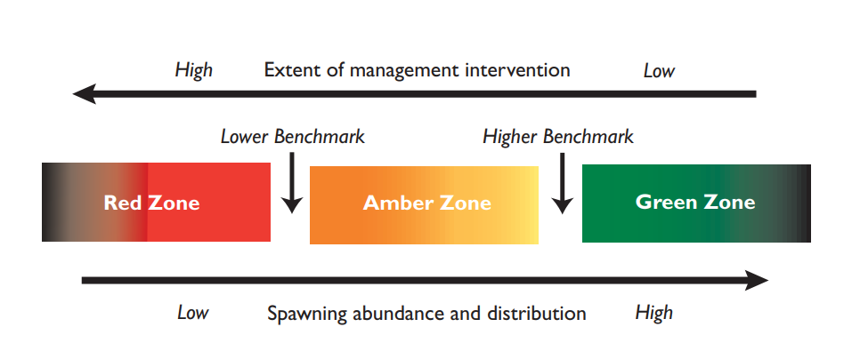

 

## Canada's Wild Salmon Policy Strategy 1
### Standardized Monitoring of Wild Salmon Status 

DFO’s <a href="https://waves-vagues.dfo-mpo.gc.ca/library-bibliotheque/315577.pdf">Wild Salmon Policy</a> recognizes the importance of monitoring and conserving salmon biodiversity. Greater biodiversity reduces the risk of extinction by increasing the likelihood that some populations will be able 
to withstand changing circumstances. Salmon biodiversity can also buffer overall abundances from periods of environmental change, since some salmon traits are better adapted to different conditions than others. 
This is called the portfolio effect; greater diversity means that more stable overall abundances can be maintained to support harvest and ecosystem function ([Schindler et al. 2010](./References.md)). 

The WSP identifies implementation strategies that are designed to maintain diversity and abundances of Pacific Salmon to the fullest extent possible. But the WSP also acknowledges that 
there likely will be circumstances when losses of wild salmon populations are unavoidable. Some catastrophic events are beyond human control and DFO may not be able to restore habitat or 
spawning populations damaged by such events.

DFO’s WSP Strategy 1 outlines a broad approach to tracking salmon biodiversity through standardized monitoring of wild salmon status. 
Within Strategy 1, the WSP prescribes three actions steps: 

[Action Step 1.1.: Identify Conservation Units (CUs)](#action-step-11-identify-conservation-units-cus)   
[Action Step 1.2: Develop Criteria to Assess CUs and Identify Benchmarks to Represent Biological Status](#action-step-12-develop-criteria-to-assess-cus-and-identify-benchmarks-to-represent-biological-status)   
[Action Step 1.3: Monitor and Assess CU Status](#action-step-13-monitor-and-assess-cu-status)  

 

#### Action Step 1.1.: Identify Conservation Units (CUs)

The Conservation Unit (CU) has been identified as the fundamental unit of biodiversity in the WSP. A CU is defined as a group of wild salmon sufficiently isolated from other groups that, if lost, 
are very unlikely to recolonize naturally within an acceptable timeframe (e.g. a human lifetime or a specified number of salmon generations) ([DFO 2005](./References)). 
<a href="https://waves-vagues.dfo-mpo.gc.ca/library-bibliotheque/334860.pdf">Pacific salmon Conservation Units</a> are delineated by their salmon ecology, life-history, and genetics.

There are 377 current CUs defined across the five species of salmon managed by DFO in the Pacific Region ([Wade et al. 2019](./References.md)). Current is a specific CU designation. Current CUs are extant 
(i.e. not extirpated), and are either part of the original CU list developed by <a href="https://waves-vagues.dfo-mpo.gc.ca/library-bibliotheque/334860.pdf">Holtby and Ciruna (2007)</a>, or have been
 modified and approved by CU experts and methodological processes that align with <a href="https://waves-vagues.dfo-mpo.gc.ca/library-bibliotheque/334860.pdf">Holtby and Ciruna (2007)</a>. 
Revisions to the original CU list have been completed for Fraser sockeye and Southern BC Chinook ([Grant et al. 2011, Brown et al. 2019](./References.md)). 

 

#### Action Step 1.2: Develop Criteria to Assess CUs and Identify Benchmarks to Represent Biological Status

DFO’s WSP provides a framework for status assessments in Strategy 1, Action Step 1.2. This includes a description of three status zones ranging from Red (poor status), to Amber (intermediate status), 
and Green (good status), and general methods for assessing statuses at the CU level. A [status assessment toolkit](./WSP Indicators and Benchmarks.md) was subsequently developed, consisting of a set of quantifiable 
metrics that fall within four classes of status indicators: abundance, trends in abundance, fishing mortality, and distribution ([Holt 2009, Holt 2010, Holt et al. 2009](./References.md)). 
To assess the WSP status of a CU, metrics are selected from [the toolkit](./WSP Indicators and Benchmarks.md) depending on the availability of data and other information for the CU. Metric values are calculated 
and are compared to metric-specific benchmarks that delineate the Red to Amber (lower benchmark) and the Amber to Green (upper benchmark) status zones to determine metric statuses (Red, Amber, or Green).

*Figure 3 in the <a href="https://waves-vagues.dfo-mpo.gc.ca/library-bibliotheque/315577.pdf">Wild Salmon Policy</a> (pg. 17) illustrates how benchmarks delineate biological status for each CU*

 

#### Action Step 1.3: Monitor and Assess CU status

The WSP outlines plans for monitoring and assessing CU abundances and spawner distributions on an annual basis. It also specifies that biological statuses are assessed annually by comparing assesment results to the benchmarks. 

In practice, application of the metric toolkit does not result in completed status assessments since statuses can differ between the metrics calculated for an individual CU. For example, the 
[percent change](./WSP Indicators and Benchmarks.md###percent-change) metric (percent change over the most recent three generations) can indicate a Red status while the [long-term trend](./WSP Indicators and Benchmarks.md###longterm-trend) metric (comparing the average escapement of the most recent generation to the long-term average) might indicate a Green status. The next step, after metrics are calculated, is an [integration process](./Integrated Status Assessments.md) that combines statuses across metrics into a single status for each CU. 

[WSP Status Assessment Toolkit: indicators, metrics, and benchmarks](./WSP Indicators and Benchmarks.md)
[Integrating metrics into WSP statuses](./Integrated Status Assessments.md)

